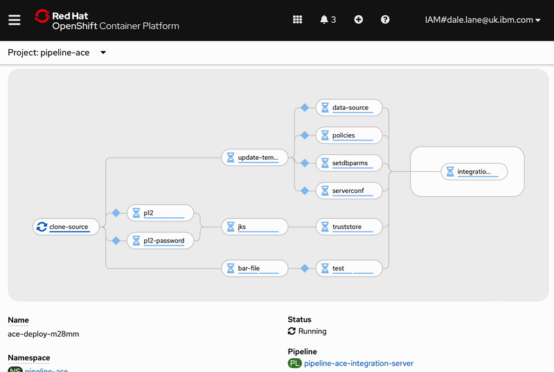
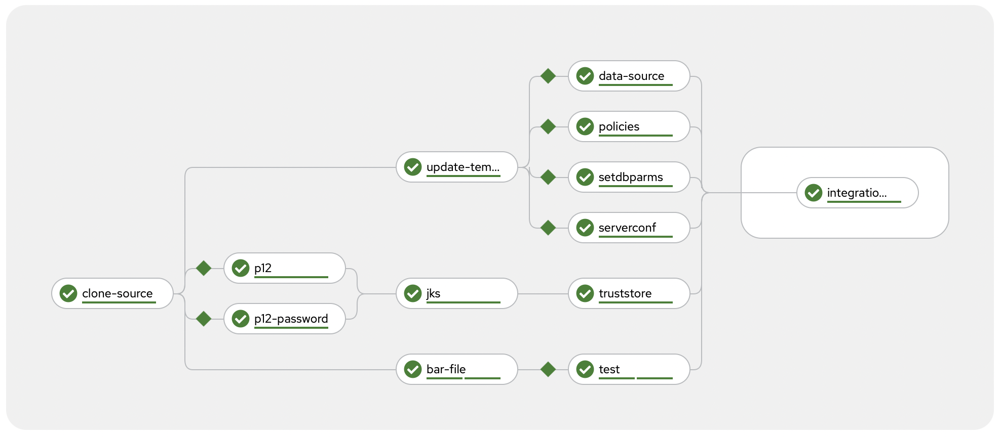

# Example pipeline for App Connect Enterprise

**An example Tekton pipeline for deploying an IBM App Connect Enterprise application to Red Hat OpenShift.**

- [Overview](#overview)
- [Pipeline](#pipeline)
- [Tests](#tests)
- [Sample ACE apps](#sample-apps)
- [Building your own app](#configuring-the-pipeline-for-your-app-connect-enterprise-application)
- [Supported versions](#supported-versions)
- [More info](#more-info)

## Overview

This repository contains an example of how to use [Tekton](https://tekton.dev) to create a CI/CD pipeline that builds and deploys an [App Connect Enterprise](https://www.ibm.com/docs/en/app-connect/containers_cd) application to [Red Hat OpenShift](https://www.ibm.com/cloud/openshift).



This pipeline uses the [IBM App Connect Operator](https://www.ibm.com/docs/en/app-connect/containers_cd?topic=operator-from-openshift-web-console) to easily build, deploy and manage your applications in containers. The pipeline runs on OpenShift to allow it to easily be integrated into an automated [continuous delivery workflow](https://www.ibm.com/garage/method/practices/deliver/practice_continuous_delivery/) without needing to build anything locally from a developer's workstation.

> For background information about the Operator, and the different resources that this pipeline will create (e.g. `IntegrationServer` and `Configuration`), see these blog posts:
> - [What is an Operator and why did we create one for IBM App Connect?](https://community.ibm.com/community/user/integration/blogs/rob-convery1/2022/05/11/ibm-app-connect-operators-part-1-what-is-an-operat)
> - [Exploring the IntegrationServer Resource of the IBM App Connect Operator](https://community.ibm.com/community/user/integration/blogs/rob-convery1/2022/05/11/ibm-app-connect-operators-part-2-exploring)


## Pipeline

The pipeline builds and deploys your App Connect Enterprise application. You need to run it every time your application has changed and you want to deploy the new version to OpenShift.

When running App Connect Enterprise in containers, there is a lot of flexibility about how much of your application is built into your container image, and how much is provided when the container starts.

> For background reading on some of the options, and some of the considerations about them, see the blog post:
> - [Comparing styles of container-based deployment for IBM App Connect Enterprise](https://community.ibm.com/community/user/integration/blogs/aiden-gallagher1/2022/07/12/comparing-styles-of-container-based-deployment-for)

This pipeline provides almost all parts of your application at runtime when the container starts. The only component that is [baked into](https://community.ibm.com/community/user/integration/blogs/aiden-gallagher1/2022/07/12/comparing-styles-of-container-based-deployment-for) the image is the application BAR file.

Baking the BAR files into custom App Connect images prevents the need to run a dedicated content server to host BAR files, however if you would prefer to do that see the documentation on [Mechanisms for providing BAR files to an integration server](https://www.ibm.com/docs/en/app-connect/containers_cd?topic=servers-mechanisms-providing-bar-files-integration-server) for more details on how to do this. (The pipeline in this repository uses the approach described as "Custom image" in that documentation.)

### Running the pipeline

|  | **link** |
| - | - |
| **pipeline spec:** | [`pipeline.yaml`](./tekton/pipeline.yaml) |
| **example pipeline runs:** | [`simple-pipelinerun.yaml`](./simple-pipelinerun.yaml) <br>[`complex-pipelinerun.yaml`](./complex-pipelinerun.yaml) |
| **helper scripts:** | [`1-deploy-simple-integration-server.sh`](./1-deploy-simple-integration-server.sh) <br>[`1-deploy-complex-integration-server.sh`](./1-deploy-complex-integration-server.sh)


**What the pipeline does**

Builds your IBM App Connect Enterprise application and deploys it to the OpenShift cluster.

**Outcome from running the pipeline**

A new version of your application is deployed with zero-downtime - replacing any existing version of the app once it is ready.

**Screenshot**


**Background**

As discussed above, most of your application configuration will be provided to your application container at runtime by the Operator using `Configuration` resources.

As shown in the screenshot above, this example pipeline currently supports many, but not all, of the types of Configuration resource:
- [Loopback data source type](https://www.ibm.com/docs/en/SSTTDS_contcd/com.ibm.ace.icp.doc/config_loopbackdatasource.html)
- [Policy project type](https://www.ibm.com/docs/en/SSTTDS_contcd/com.ibm.ace.icp.doc/config_policyproject.html)
- [setdbparms.txt type](https://www.ibm.com/docs/en/SSTTDS_contcd/com.ibm.ace.icp.doc/config_setdbparmstxt.html)
- [server.conf.yaml type](https://www.ibm.com/docs/en/SSTTDS_contcd/com.ibm.ace.icp.doc/config_serverconfyaml.html)
- [Truststore type](https://www.ibm.com/docs/en/SSTTDS_contcd/com.ibm.ace.icp.doc/config_truststore.html)

For more information about the other Configuration types, see the documentation on [Configuration types for integration servers](https://www.ibm.com/docs/en/app-connect/containers_cd?topic=servers-configuration-types-integration). Adding support for any of these additional types would involve adding additional tasks to the [tasks provided in this repo](./tekton/tasks/) - the existing tasks are commented to help assist with this.

Each of these configuration resources is individually optional. Two example App Connect applications are provided to show how the pipeline supports different application types.

#### Simple stand-alone applications

The pipeline can be used to deploy a stand-alone application with no configuration dependencies.

| | **link** |
| - | - |
| **sample application** | [simple-demo](./ace-projects/simple-demo/) |
| **pipeline run config** | [`simple-pipelinerun.yaml`](./simple-pipelinerun.yaml) |
| **demo script:** | [`1-deploy-simple-integration-server.sh`](./1-deploy-simple-integration-server.sh) |


This is a simple App Connect application with no external configuration.


When deploying this, the pipeline skips all of the Configuration tasks:


Watching the pipeline run looks like this (except it takes longer).


#### Complex applications

The pipeline can be used to deploy complex applications with multiple configuration dependencies and supporting Java projects.

| | **link** |
| - | - |
| **sample application** | [sample-ace-application](./ace-projects/sample-ace-application/) |
| **pipeline run config** | [`complex-pipelinerun.yaml`](./complex-pipelinerun.yaml) |
| **demo script:** | [`1-deploy-complex-integration-server.sh`](./1-deploy-complex-integration-server.sh) |


This is an example of an App Connect application that needs configuration for connecting to:
- a PostgreSQL database
- an external HTTP API
- an Apache Kafka cluster


When deploying this, the pipeline runs all of the Configuration tasks required for this application:



Watching the pipeline run (also sped up!) it looks like this.


To avoid needing to store credentials in git with your application code, the pipeline retrieves credentials from Kubernetes secrets. When [configuring the pipeline for your application](#configuring-the-pipeline-for-your-app-connect-enterprise-application) you need to specify the secrets it should use to do this.

## Tests

If you have a [test project](https://www.ibm.com/docs/en/app-connect/12.0?topic=tests-running-integration) for your App Connect application, the pipeline can run this test as well.

Provide the name of your test project in the pipeline config, and your tests will be run after the BAR file is built.

If you don't provide a test project, the test step in the pipeline will be skipped.

## Sample apps

I've put notes on how I set up the sample apps to demonstrate the pipeline in [demo-pre-reqs/README.md](./demo-pre-reqs/README.md) however neither of the sample apps are particularly useful and were purely used to test and demo the pipeline.

You can import them into [App Connect Toolkit](https://www.ibm.com/docs/en/app-connect/containers_cd?topic=developing-integrations-in-app-connect-toolkit) to edit them if you want to by:

1. **File** -> **Import...** -> **Projects from Folder or Archive**
2. Put the location of the [ace-projects](./ace-projects/) folder as the **Import source**.
3. Tick all of the projects

That will let you open the projects and work on them locally. If you're curious what they do, I'll include some brief notes below:

### Simple app

It provides an HTTP endpoint that returns a Hello World message.


Running this:
```sh
curl "http://$(oc get route -nace-demo hello-world-http -o jsonpath='{.spec.host}')/hello"
```

returns this:
```json
{"hello":"world"}
```

#### Test

A test for this app is provided in [simple-demo_Test](./ace-projects/simple-demo_Test/).

To run it:
1. Create a local integration server called `TEST_SERVER` (inheriting the configuration in the [TEST_SERVER](./ace-projects/TEST_SERVER/) folder)
2. Run the test launch configuration [simple-demo_Test.launch](./ace-projects/simple-demo_Test/simple-demo_Test.launch)

### Complex app

It provides an intentionally contrived event-driven flow that:
- "Kafka consumer todo updates"
    - receives a JSON message from a Kafka topic
- "get id from update message"
    - parses the JSON message and extracts an ID number from it
    - uses the id number to create an HTTP URL for an external API
- "retrieve current todo details"
    - makes an HTTP GET call to the external API
- "base64 encode the description"
    - transforms the response from the external API using a custom Java class
- "insert into database"
    - inserts the transformed response payload into a PostgreSQL database


The aim of this application was to demonstrate an ACE application which needed a variety of Configuration resources.

But it means that running this:
```sh
echo '{"id": 1, "message": "quick test"}' | kafka-console-producer.sh \
    --bootstrap-server $BOOTSTRAP \
    --topic TODO.UPDATES \
    --producer-property "security.protocol=SASL_SSL" \
    --producer-property "sasl.mechanism=SCRAM-SHA-512" \
    --producer-property "sasl.jaas.config=org.apache.kafka.common.security.scram.ScramLoginModule required username="appconnect-kafka-user" password="$PASSWORD";" \
    --producer-property "ssl.truststore.location=ca.p12" \
    --producer-property "ssl.truststore.type=PKCS12" \
    --producer-property "ssl.truststore.password=$CA_PASSWORD"
```

gets you this:
```
store=# select * from todos;
 id | user_id |       title        |            encoded_title             | is_completed
----+---------+--------------------+--------------------------------------+--------------
  1 |       1 | delectus aut autem | RU5DT0RFRDogZGVsZWN0dXMgYXV0IGF1dGVt | f
(1 row)
```

#### Test

A test for this app is provided in [sample-ace-application_Test](./ace-projects/sample-ace-application_Test/).

To run it:
1. Create a local integration server called `TEST_SERVER` (inheriting the configuration in the [TEST_SERVER](./ace-projects/TEST_SERVER/) folder)
2. Run the test launch configuration [sample-ace-application_Test.launch](./ace-projects/sample-ace-application_Test/sample-ace-application_Test.launch)


## Configuring the pipeline for your App Connect Enterprise application

To run the pipeline for your own application, you need to first create a `PipelineRun`.

The sample pipeline runs described above provide a good starting point for this, which you can modify to your own needs. You need to specify the location of your App Connect Enterprise application code and configuration resources. All of the available parameters are documented in the [pipeline spec](./tekton/pipeline.yaml#L20-L199) if further guidance is needed.


## Supported versions

This sample pipeline was tested on OpenShift 4.10.

You can see the versions of what I was running on OpenShift at [./demo-pre-reqs/operators/](./demo-pre-reqs/operators/). It is possible that this pipeline would need modifying to work with different versions of OpenShift, Tekton, or App Connect.

## More info

For help with using this or if you have any questions, please create an issue or <a href="https://github.com/dalelane">contact me</a>.
